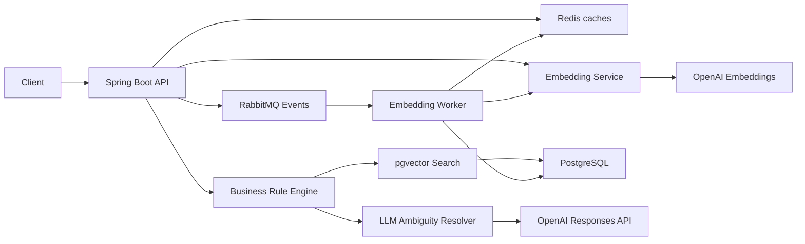
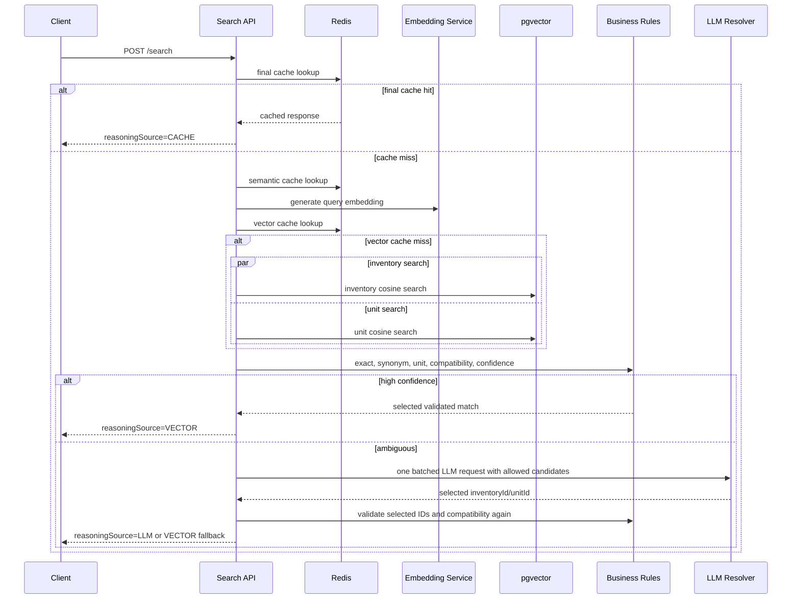
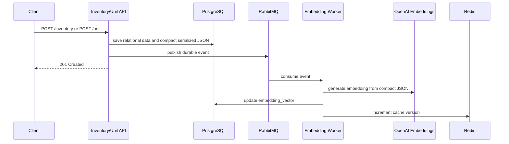

# Architecture

## Component View

## Search Sequence

## Async Embedding Sequence

## Hallucination Boundary

The LLM receives only:

- original query
- retrieved inventory candidates
- retrieved unit candidates
- similarity scores
- valid compatibility mappings

The LLM may:

- rank candidates
- choose one candidate
- explain ambiguity briefly

The LLM may not:

- invent a product
- invent a unit
- invent stock mappings
- invent compatibility rules
- override an invalid compatibility rule
