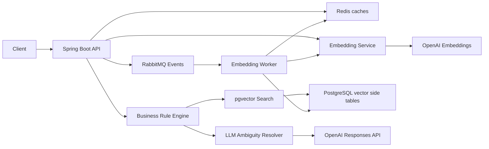
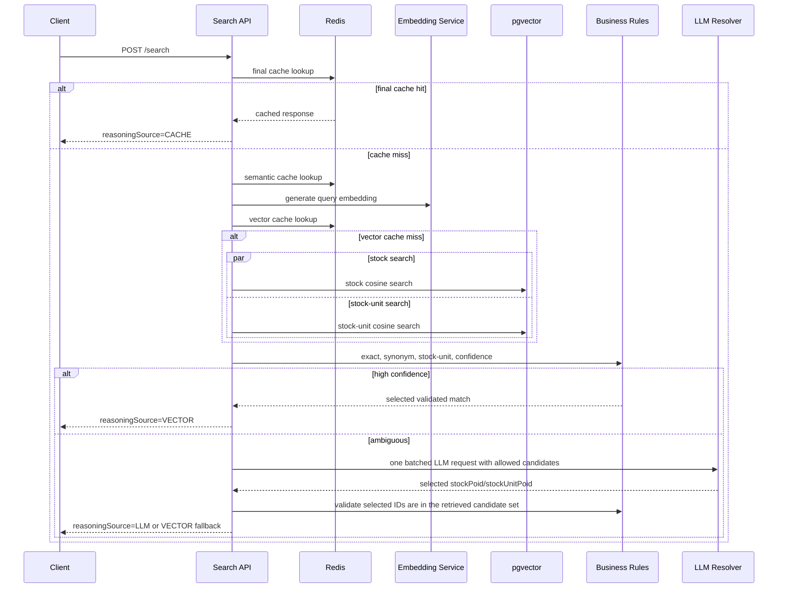
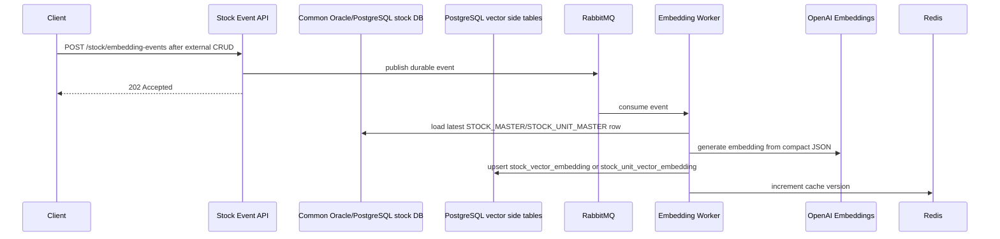

# Architecture

## Component View

## Search Sequence

## Async Embedding Sequence

## Hallucination Boundary

The LLM receives only:

- original query
- retrieved stock candidates
- retrieved stock-unit candidates
- similarity scores

The LLM may:

- rank candidates
- choose one candidate
- explain ambiguity briefly

The LLM may not:

- invent a stock item
- invent a stock unit
- invent stock mappings
- select IDs outside the retrieved candidate set
