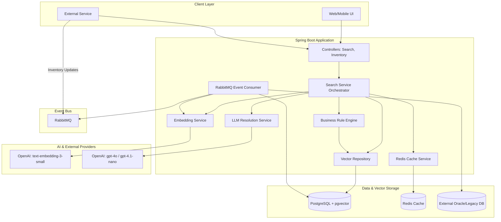
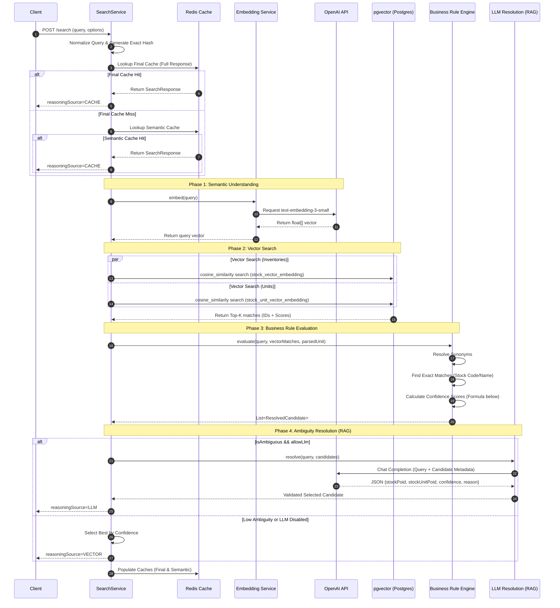
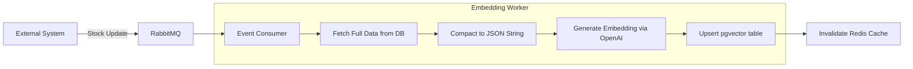
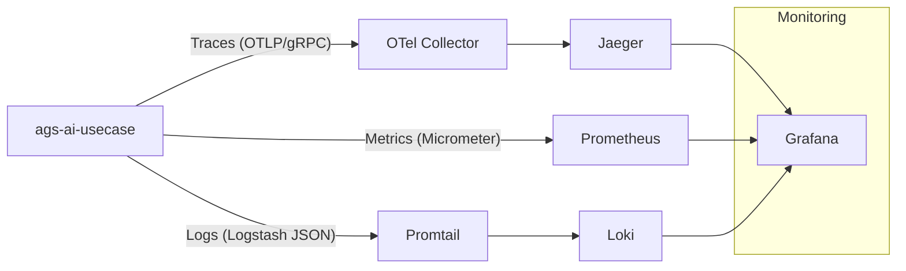

# In-Depth Architecture & Flow Diagrams - ags-ai-usecase

This document provides a detailed view of the `ags-ai-usecase` service architecture, request processing flows, and system integrations.

## 1. System Component Architecture

The service follows a modern Spring Boot architecture integrated with AI services (OpenAI) and a vector-enabled database (pgvector).

---

## 2. Detailed Search Flow (Sequence)

This diagram shows the complete lifecycle of a `/search` request, including multi-layer caching and RAG-based ambiguity resolution.

---

## 3. Asynchronous Embedding Pipeline

How the system keeps the vector database synchronized with the main inventory system.

---

## 4. Core Data Model

The system operates on two primary entities: **Stock Master** and **Stock Unit**, with corresponding vector embeddings stored in pgvector.

### 4.1 Entities
- **InventoryEntity (Stock Master)**:
  - `stockPoid`: Primary key (Long).
  - `stockCode`: Unique identifier (e.g., SKU).
  - `stockName`: Primary search target.
  - `stockDescription`: Context for embeddings.
- **UnitEntity (Stock Unit)**:
  - `stockUnitPoid`: Primary key (Long).
  - `stockUnitCode`: Short code (e.g., "KG", "PCS").
  - `stockUnitName`: Full name (e.g., "Kilograms").

### 4.2 Vector Tables (pgvector)
- `stock_vector_embedding`: Stores `stockPoid` + `embedding` (vector 1536).
- `stock_unit_vector_embedding`: Stores `stockUnitPoid` + `embedding` (vector 1536).

---

## 5. Confidence Scoring Logic

The `ConfidenceCalculator` uses a weighted formula to rank candidates:

**Score Formula:**
$$Score = (InvSim \times 0.58) + (UnitSim \times 0.22) + ExactBoost + UnitBoost + SynonymBonus + CompatibilityBonus$$

| Component | Weight / Value | Description |
| :--- | :--- | :--- |
| **Inventory Similarity** | 0.58 | Cosine similarity from pgvector for Stock Master. |
| **Unit Similarity** | 0.22 | Cosine similarity from pgvector for Stock Unit. |
| **Exact Boost** | +0.18 | Granted if Query contains exact Stock Code or Name. |
| **Unit Boost** | +0.12 | Granted if Query mentions the specific Unit (e.g., "KG", "PCS"). |
| **Synonym Bonus** | +0.05 | Granted if a synonym was used for matching. |
| **Compatibility** | +0.08 / -0.40 | Heavy penalty if the unit is incompatible with the stock category. |

---

## 5. Observability Stack

The system implements a full "LPG" stack (Loki, Prometheus, Grafana) + Jaeger for distributed tracing.

- **Metrics**: Search latency, token usage, cache hit ratios, confidence distribution.
- **Traces**: End-to-end tracing of search requests including OpenAI API calls and Vector DB queries.
- **Logs**: Structured JSON logs correlated with trace IDs for easy debugging.
